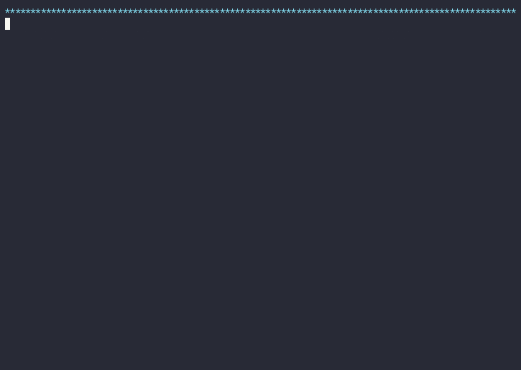

# HA Chromium Kiosk Setup

[](https://github.com/kunaalm/HA-Chromium-Kiosk/actions/workflows/lint.yml)
[](https://github.com/kunaalm/HA-Chromium-Kiosk/releases/latest)
[](LICENSE)

A one-command setup script for a full-screen Chromium kiosk showing your Home Assistant dashboard — no display manager, touch-friendly, and installable on any Debian-based Linux box (including a Raspberry Pi).

**A real install, against a real Home Assistant instance:**



**Real operations on that same dashboard, once it's up:**


## Quick Start

```bash
wget -O ha-chromium-kiosk-setup.sh https://github.com/kunaalm/HA-Chromium-Kiosk/releases/latest/download/ha-chromium-kiosk-setup.sh
chmod +x ha-chromium-kiosk-setup.sh
sudo ./ha-chromium-kiosk-setup.sh install
```

You'll be prompted for your Home Assistant's IP, port, and dashboard path — see [Usage](#usage) below for the full prompt list. New here? Read [Which doc do I need?](#which-doc-do-i-need) first.

## Which doc do I need?

| I want to... | Read |
|---|---|
| Install the kiosk right now | This README's [Quick Start](#quick-start) / [Usage](#usage) |
| See a full walkthrough with real screenshots and terminal output | [docs/how-to-kiosk-setup.md](docs/how-to-kiosk-setup.md) |
| Check I meet the requirements first | [Prerequisites](#prerequisites) below |
| Something went wrong | [Troubleshooting / FAQ](#troubleshooting--faq) below |
| Contribute a change or test one | [CONTRIBUTING.md](CONTRIBUTING.md) + [TESTING.md](TESTING.md) |
| See what changed between versions | [Releases page](https://github.com/kunaalm/HA-Chromium-Kiosk/releases) |

## Prerequisites

Check these off before running the script:

- [ ] **Debian-based Linux** (Debian, Raspberry Pi OS, etc.) — the script uses `apt-get` directly.
- [ ] **Root/sudo access** — the script refuses to run unless invoked as root.
- [ ] **The `sudo` binary itself is installed**, even though you invoke the script with `sudo` (some steps internally run as the `kiosk` user via `sudo -u kiosk ...`). Minimal Debian images often lack it — install first if needed: `apt-get update && apt-get install -y sudo`. The script checks for this and exits with a clear error if it's missing, rather than failing deep into the install.
- [ ] **No display manager running** (GDM/LightDM/SDDM) — this script replaces one with auto-login + Openbox + a systemd service; it doesn't coexist with an existing one.
- [ ] **Internet access** for `apt-get` — the script installs its own dependencies (`xorg`, `openbox`, `chromium`, `xinit`, `unclutter`, `curl`, `netcat-openbsd`) automatically.
- [ ] **A reachable Home Assistant instance** — have its IP/hostname, port, and dashboard path (e.g. `lovelace/default_view`) ready.
- [ ] *(Optional)* **The [Kiosk Mode](https://github.com/NemesisRE/kiosk-mode) HA plugin**, if you want Home Assistant's own sidebar/header hidden too, not just the browser's chrome. See the note in [Features](#features) below — not required for the kiosk to work, and the installer detects and tells you if it's missing.

## Summary

The `ha-chromium-kiosk-setup.sh` script:
- Updates and upgrades Debian system packages.
- Creates a dedicated `kiosk` user for the kiosk environment.
- Installs X server, Chromium, Openbox, and supporting utilities.
- Configures auto-login for the `kiosk` user without a display manager.
- Sets up Openbox to run Chromium in full-screen kiosk mode for your Home Assistant dashboard.
- Optionally hides the mouse cursor for touchscreens.
- Configures and enables a systemd service so the kiosk starts on boot.

## Features

- Automatically logs in a `kiosk` user on system boot
- Runs Chromium in full-screen kiosk mode for Home Assistant, via Openbox
- HTTP or HTTPS Home Assistant instances
- Optional display rotation (normal/left/right/inverted) for Pi + touchscreen setups
- Optional pinch-to-zoom disable and a configurable default zoom level
- Optionally hides the mouse pointer
- Starts and manages the kiosk session via a systemd service
- Tailored for touchscreen displays with pull-to-refresh support
- Color-coded, spinner-animated install/uninstall UI with a pre-action summary and confirmation
- Working `help` command

**On hiding Home Assistant's sidebar/header**: this script's own kiosk mode uses Chromium's `--kiosk` flag, which hides the *browser's* chrome (address bar, tabs) — it cannot reach into Home Assistant's own in-page sidebar/header, which is rendered by HA's frontend JavaScript. Hiding that too requires installing the separate [Kiosk Mode](https://github.com/NemesisRE/kiosk-mode) plugin **inside Home Assistant itself** (via HACS, or manually). This is optional — the installer detects it automatically (best-effort, non-blocking) and tells you if it's missing, with both install paths.

> **Compatibility note (checked 2026-09-07):** as of its latest release (v14.1.0), the Kiosk Mode plugin does not actually hide the sidebar/header on Home Assistant 2026.9.1 in our testing, even when correctly installed and detected. Checking the plugin's own issue tracker shows a recurring pattern — it has broken on nearly every recent HA frontend release (2026.1, .2, .3, .4, .6 all have closed "broken by this HA version" issues) and needs a version-matched patch each time; its last release confirmed working was paired with HA 2026.6.0. If you hit this, check the [plugin's compatibility table](https://github.com/NemesisRE/kiosk-mode#readme) for the version matching your HA release before assuming it's a configuration mistake. This script's own kiosk mode (Chromium's `--kiosk` flag) is unaffected either way.

See the [how-to guide](docs/how-to-kiosk-setup.md#caveat-kiosktrue-doesnt-hide-the-ha-sidebar-by-itself) for full details on both the plugin and this compatibility issue.

## Usage

1. **Download the script** (always resolves to the latest release):
   ```bash
   wget -O ha-chromium-kiosk-setup.sh https://github.com/kunaalm/HA-Chromium-Kiosk/releases/latest/download/ha-chromium-kiosk-setup.sh
   ```
   Or, for the in-development version: `.../raw.githubusercontent.com/kunaalm/HA-Chromium-Kiosk/main/ha-chromium-kiosk-setup.sh`

2. **Verify the download** (recommended, since this script requires sudo). Each [release](https://github.com/kunaalm/HA-Chromium-Kiosk/releases/latest) publishes its exact sha256 checksum in its notes — copy it from there:
   ```bash
   echo "<checksum-from-release-notes>  ha-chromium-kiosk-setup.sh" | sha256sum -c -
   ```

3. **Make it executable and run it:**
   ```bash
   chmod +x ha-chromium-kiosk-setup.sh
   sudo ./ha-chromium-kiosk-setup.sh install
   ```
   You'll be prompted to:
   - Enter your Home Assistant instance's IP/hostname (required)
   - Confirm the port (defaults to `8123`)
   - Enter your dashboard path (defaults to `lovelace/default_view`)
   - Choose HTTP or HTTPS
   - Choose whether to enable kiosk mode (`?kiosk=true` appended to the URL)
   - Choose display rotation, pinch-zoom, and cursor-hiding options
   - Confirm a summary before anything is changed

   **To uninstall:**
   ```bash
   sudo ./ha-chromium-kiosk-setup.sh uninstall
   ```

4. **Reboot** when prompted (or later) to activate the kiosk environment.

For a full walkthrough with real screenshots and terminal output from an actual run, see [docs/how-to-kiosk-setup.md](docs/how-to-kiosk-setup.md).

## Troubleshooting / FAQ

- **The kiosk isn't showing up after reboot** — check the systemd service status:
  ```bash
  sudo systemctl status ha-chromium-kiosk.service
  ```
- **Chromium shows a "can't reach this page" / connection error** — verify the Home Assistant IP/port you entered is actually reachable from the kiosk machine (`curl http://<ha-ip>:<port>`), and that nothing (firewall, VLAN) blocks it.
- **The script exits immediately saying it needs to be run as root** — re-run with `sudo ./ha-chromium-kiosk-setup.sh install`.
- **The script exits saying `sudo` isn't installed** — install it first: `apt-get update && apt-get install -y sudo`, then re-run (see [Prerequisites](#prerequisites)).
- **Home Assistant's sidebar/header is still visible even with kiosk mode enabled** — this is expected unless you've also installed the separate [Kiosk Mode](https://github.com/NemesisRE/kiosk-mode) plugin inside Home Assistant. Chromium's own kiosk flag can't hide HA's in-page UI. See [Features](#features) above.
- **I need to change a setting after installing** (IP, rotation, zoom, etc.) — re-run `sudo ./ha-chromium-kiosk-setup.sh install` with the new answers; it's safe to run again.
- **Something else is wrong** — check [existing issues](https://github.com/kunaalm/HA-Chromium-Kiosk/issues) or [open a new one](https://github.com/kunaalm/HA-Chromium-Kiosk/issues/new/choose) with your OS, Home Assistant version, and the exact error output.

## Versioning

Releases follow semantic versioning (MAJOR.MINOR.PATCH). See the [Releases page](https://github.com/kunaalm/HA-Chromium-Kiosk/releases) for the full changelog, checksums, and downloadable assets for every version — each release's notes are generated automatically at tag time so they're always accurate for that exact version.

## Contributing & Testing

See [CONTRIBUTING.md](CONTRIBUTING.md) for how to propose a change, and [TESTING.md](TESTING.md) for the full test plan (static analysis, function-level dry runs, generated-artifact verification, and real systemd integration tests) that any change should pass before merge.

## Important Information

**Disclaimer**: This script is provided "as is," without warranty of any kind, express or implied. By using it you assume all risks. It's intended for educational and personal use, not commercial deployments.

**License**: Apache License, Version 2.0 — see [LICENSE](LICENSE).

### Author
**Kunaal Mahanti**

If you encounter any problems or have suggestions, feel free to [open an issue](https://github.com/kunaalm/HA-Chromium-Kiosk/issues/new/choose).
