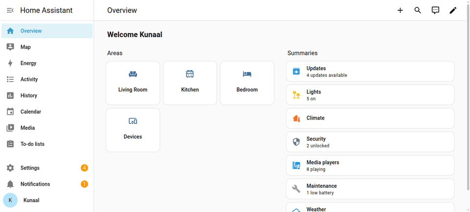

# How-To: Set Up a Home Assistant Kiosk with HA Chromium Kiosk

This is a step-by-step guide to installing the kiosk against your existing
Home Assistant instance. It assumes Home Assistant is already set up and
running somewhere reachable — this guide only covers the kiosk side.

The steps, terminal output, and screenshots below are from a real
end-to-end validation run (a Debian+systemd test environment installed
against a live Home Assistant instance on the same network), not
simulated.

## What you'll end up with

A Debian machine that auto-boots into a full-screen Chromium window
showing your Home Assistant dashboard — no desktop environment, no manual
login required.

## Prerequisites

See the [README's Prerequisites section](../../README.md#prerequisites)
for the kiosk machine's requirements. You'll additionally need, from your
existing Home Assistant instance:
- Its IP address or hostname, reachable over the network from the kiosk
  machine (same LAN, or routed).
- The port it's listening on (default `8123`).
- The dashboard path you want to display (default `lovelace/default_view`).

## 1. Download and verify

On the Debian machine that will become the kiosk (**not** the Home
Assistant machine — these should be separate devices):

```bash
wget -O ha-chromium-kiosk-setup.sh https://raw.githubusercontent.com/kunaalm/ha-chromium-kiosk/v0.10.2/ha-chromium-kiosk-setup.sh
echo "32c1b63a794f5df88bff27cb2f9eda7acc96b2d80be3dc3d198df84970988a98  ha-chromium-kiosk-setup.sh" | sha256sum -c -
chmod +x ha-chromium-kiosk-setup.sh
```

## 2. Run the installer

```bash
sudo ./ha-chromium-kiosk-setup.sh install
```

You'll see the banner, then a summary of what's about to happen, requiring
confirmation before anything is touched:

```
****************************************************************************************************
    __  _____       ________                         _                    __ __ _            __
   / / / /   |     / ____/ /_  _________  ____ ___  (_)_  ______ ___     / //_/(_)___  _____/ /__
  / /_/ / /| |    / /   / __ \/ ___/ __ \/ __ `__ \/ / / / / __ `__ \   / ,<  / / __ \/ ___/ //_/
 / __  / ___ |   / /___/ / / / /  / /_/ / / / / / / / /_/ / / / / / /  / /| |/ / /_/ (__  ) ,<
/_/ /_/_/  |_|   \____/_/ /_/_/   \____/_/ /_/ /_/_/\__,_/_/ /_/ /_/  /_/ |_/_/\____/____/_/|_|

                        Setup and Install or Uninstall Script for HA Chromium Kiosk
****************************************************************************************************
***                               WARNING: USE AT YOUR OWN RISK                                  ***
****************************************************************************************************
This script will:
 * Create a dedicated kiosk user
 * Install necessary packages (X server, Chromium, Openbox)
 * Configure auto-login for the kiosk user
 * Set up Chromium in kiosk mode for Home Assistant
 * Create a systemd service to start the kiosk on boot
* Please read the script before running it to understand what it does.
* Use at your own risk. The author is not responsible for any damage or data loss.
Press [Enter] to continue or [Ctrl+C] to exit
-- Summary of Actions --
 The installation will:
 1. Create a dedicated kiosk user
 2. Install necessary packages:
    - X server (xorg, xserver-xorg)
    - Window manager (openbox)
    - Browser (chromium)
    - Utilities (xinit, unclutter, curl, netcat-openbsd)
 3. Configure auto-login for the kiosk user
 4. Set up Chromium in kiosk mode for Home Assistant
 5. Create a systemd service to start the kiosk on boot
------------------------
```

## 3. Answer the prompts

The installer asks for these, in order (this is the exact sequence as of
v0.10.2 — verify against the live script if it's been updated since,
see `TESTING.md`):

| Prompt | What to enter |
|---|---|
| Proceed with install? | `Y` |
| HA IP address | Your Home Assistant's IP/hostname |
| HA port | Usually `8123` |
| Dashboard path | Usually `lovelace/default_view` |
| Use HTTPS? | `Y` if HA is behind TLS, else `N` |
| Enable kiosk mode? | `Y` (appends `?kiosk=true` to the URL — see the [caveat below](#caveat-kiosktrue-doesnt-hide-the-ha-sidebar-by-itself)) |
| Hide mouse cursor? | `Y` for touchscreens |
| Rotate display? | `N` unless mounted sideways/upside-down |
| Disable pinch-to-zoom? | `N` unless it's a shared touchscreen |
| Default zoom % | `100` unless you want a different default |
| Reboot now? | `Y` to activate immediately |

## 4. Package installation

Each package installs with a live spinner and a pass/fail result:

```
Creating the kiosk user...
 Done.
Checking required packages...
Installing missing packages...
Installing package 1 of 8: xorg
\ Installing xorg...
| Installing xorg...
...
OK Installed xorg
 Done.
...
Installing package 8 of 8: netcat-openbsd
...
OK Installed netcat-openbsd
 Done.
All missing packages have been installed.
```

## 5. Configuration and completion

```
Your Home Assistant dashboard will be displayed at: http://<HA_IP>:8123/lovelace/default_view?kiosk=true
Setting up Chromium Kiosk Mode for Home Assistant URL:http://<HA_IP>:8123/lovelace/default_view?kiosk=true
Checking whether the Kiosk Mode HA plugin is installed (hides the HA sidebar/header)...
[... plugin check result, see caveat below ...]
Configuring auto-login for the kiosk user...
Configuring Openbox for the kiosk user...
Creating the kiosk startup script...
Configuring Openbox to start the kiosk script...
Creating the systemd service...
Created symlink /etc/systemd/system/multi-user.target.wants/ha-chromium-kiosk.service -> /etc/systemd/system/ha-chromium-kiosk.service.
Adding the kiosk user to the tty group...
Setup is complete. Please reboot the system manually when ready.
Installation complete.
```

## 6. Reboot

```bash
sudo reboot
```

On boot, the kiosk user auto-logs in on tty1, Openbox starts, and the
kiosk script (`/usr/local/bin/ha-chromium-kiosk.sh`) launches Chromium
full-screen pointed at your Home Assistant dashboard.

## Validating the connection

The generated kiosk script waits for Home Assistant to become reachable
before launching Chromium (up to 30 attempts, 2 seconds apart). This is
what a successful connection looks like, confirmed against a real, live
Home Assistant instance during this guide's validation:

```
$ bash /usr/local/bin/ha-chromium-kiosk.sh
Checking if Home Assistant is reachable at <HA_IP>:8123...
Connection to Home Assistant established!
Home Assistant is reachable. Starting Chromium...
```

(`xset`/`unclutter: could not open display` lines in a headless test
environment are expected — they need a real X display, which only exists
on actual hardware with a monitor attached. The network check above is
display-independent and is the part that confirms connectivity.)

Once Chromium launches, you should see your dashboard full-screen:


## Real Home Assistant operations

The kiosk just displays whatever's on the dashboard — so to be clear about
what you'll actually be looking at all day, here's a real dashboard with
real entities (Home Assistant's own built-in demo integration — lights,
climate, water heaters, covers) being operated the same way you would on
the kiosk screen: toggling a light, adjusting brightness, and changing a
thermostat setpoint. Every state change below is a real, verified HA
state change, not a mockup:



## Caveat: `?kiosk=true` doesn't hide the HA sidebar by itself

Chromium's own `--kiosk` flag (used by this script) hides the *browser's*
chrome — address bar, tabs. It does **not** hide Home Assistant's own
sidebar and header, which are rendered in-page by HA's frontend
JavaScript, something Chromium's kiosk flag has no way to reach into.
This is what the screenshot above shows — sidebar and header still
visible.

`?kiosk=true` (or the shorter `?kiosk`) genuinely does hide HA's
sidebar/header, but only if the separate, actively-maintained
[Kiosk Mode](https://github.com/NemesisRE/kiosk-mode) plugin (HACS
Default, 789+ stars, regularly updated against new HA releases) is
installed **inside Home Assistant itself** — this script cannot install
it for you (that would need Home Assistant API credentials this
installer intentionally doesn't collect).

**As of v0.10.2, the installer checks for this automatically** (a
best-effort, non-blocking probe of HA's own static file server) and
tells you if it's missing, with both install paths:

```
Checking whether the Kiosk Mode HA plugin is installed (hides the HA sidebar/header)...
NOTE: The Kiosk Mode plugin does not appear to be installed in Home Assistant.
Without it, the HA sidebar and header will remain visible even with kiosk mode enabled here -
Chromium's own kiosk flag only hides the browser's own UI, not HA's in-page sidebar.

To hide the sidebar/header, install the separate 'Kiosk Mode' plugin IN Home Assistant:
  - Via HACS (recommended if you use HACS): search for 'Kiosk Mode' in HACS > Frontend.
  - Manually: download kiosk-mode.js from https://github.com/NemesisRE/kiosk-mode/releases/latest,
    place it in Home Assistant's www/ folder, then add it as a Lovelace resource
    (Settings > Dashboards > ... menu > Resources > Add Resource).

This is entirely optional and does not block this installation - continuing.
```

This is entirely optional — the kiosk works fine without it, you just get
HA's sidebar/header visible inside the full-screen Chromium window rather
than a fully chrome-free dashboard.

### Compatibility note (checked 2026-09-07)

Even with the plugin correctly installed and detected, we found it did
**not** actually hide the sidebar/header when tested against Home
Assistant 2026.9.1 with the plugin's latest release (v14.1.0) — the
sidebar stayed visible with no JavaScript errors and the plugin's script
loading successfully (HTTP 200, confirmed via the browser's network
inspector).

This isn't unique to our setup — the plugin's own GitHub issue tracker
shows a recurring pattern of breaking on nearly every recent Home
Assistant frontend release (closed "broken by this HA version" issues
exist for HA 2026.1, .2, .3, .4, and .6), each requiring a version-matched
plugin patch before it works again. Its last release confirmed compatible
by its own maintainers was paired with HA 2026.6.0 — nothing has yet
confirmed working compatibility with 2026.9.x as of this check.

**If the plugin doesn't hide your sidebar even though it's installed and
detected:** check the [compatibility table in the plugin's own
README](https://github.com/NemesisRE/kiosk-mode#readme) for the plugin
version that matches your Home Assistant version, rather than assuming a
configuration mistake. This script's own kiosk mode (Chromium's `--kiosk`
flag, hiding the browser's own chrome) is unaffected by this either way —
only the HA-side sidebar/header hiding depends on the plugin working.

## Troubleshooting

- **Kiosk shows a "can't connect" browser error on boot**: check
  `systemctl status ha-chromium-kiosk.service` and confirm Home Assistant
  is actually reachable from the kiosk machine (`nc -zv <HA_IP> <PORT>`).
- **Auto-login doesn't happen**: check
  `/etc/systemd/system/getty@tty1.service.d/override.conf` exists and
  references the correct kiosk username.
- **Need to change settings after install**: re-run
  `sudo ./ha-chromium-kiosk-setup.sh install` — it detects existing
  config and asks before overwriting each piece (declining an individual
  overwrite only skips that step, not the whole run — see issue #25).
- **Uninstalling**: `sudo ./ha-chromium-kiosk-setup.sh uninstall`.
- **Want the HA sidebar/header hidden too**: see the
  [caveat above](#caveat-kiosktrue-doesnt-hide-the-ha-sidebar-by-itself).

## See also

- [README.md](../../README.md) — full feature list, prerequisites, options reference.
- [TESTING.md](../../TESTING.md) — the test plan this guide's validation run was based on.
