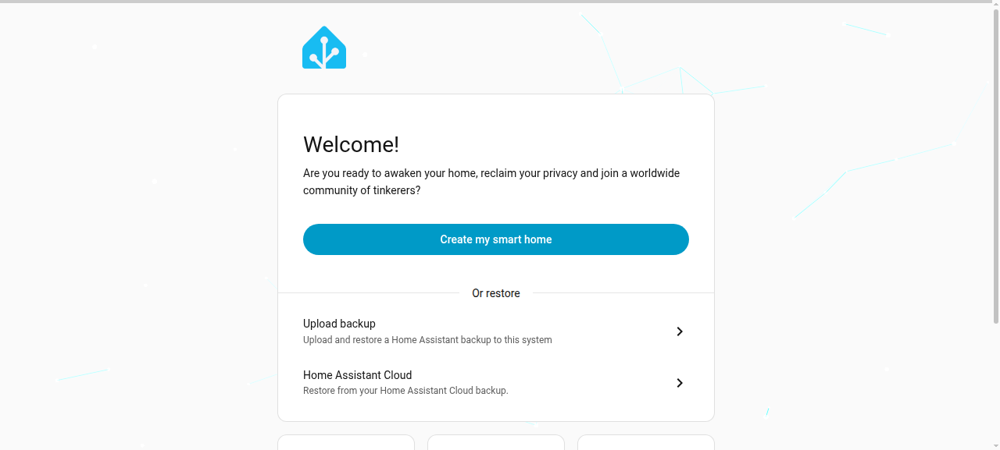
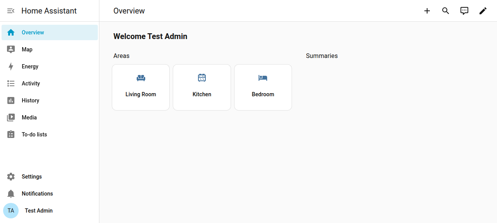

# How-To: Set Up a Home Assistant Kiosk with HA Chromium Kiosk

This walks through the full loop: standing up a Home Assistant instance,
installing the kiosk on a Debian machine pointed at it, and confirming the
kiosk can actually reach and display your dashboard. Every step below was
run for real (Docker containers on the same network — Home Assistant on
one, a fresh Debian+systemd environment on the other) as validation before
writing this doc; screenshots and terminal output are genuine, not
mocked up.

## What you'll end up with

- A running Home Assistant instance with an admin account and a default
  dashboard.
- A Debian machine configured to auto-boot into a full-screen Chromium
  window showing that dashboard, no desktop environment, no manual login.

## Prerequisites

See the main [README's Prerequisites section](../../README.md#prerequisites)
for the kiosk machine's requirements. You'll additionally need:
- A running Home Assistant instance, reachable over the network from the
  kiosk machine (same LAN, or routed).
- Its IP address or hostname, the port it's listening on (default `8123`),
  and the dashboard path you want to display (default
  `lovelace/default_view`).

## Part 1: Setting up Home Assistant

If you already have Home Assistant running, skip to
[Part 2](#part-2-installing-the-kiosk). This section covers a from-scratch
setup so the whole loop is testable end to end.

### 1.1 First launch

On first visit, Home Assistant shows its onboarding welcome screen:



Click through to create an account (name, username, password), set your
home's location (used for sun/weather-based automations — defaults are
fine for testing), and decide whether to opt into anonymous usage
analytics. None of these choices matter for the kiosk itself.

### 1.2 Dashboard ready

Once onboarding finishes, you land on the default **Overview** dashboard —
this is what the kiosk will display:


Note the IP address or hostname this instance is reachable at — you'll
need it during kiosk installation. In this test setup, Home Assistant and
the kiosk machine were both Docker containers on the same bridge network,
and HA was reachable at its container IP (`172.20.0.2`) on port `8123`.

## Part 2: Installing the Kiosk

### 2.1 Download and verify

On the Debian machine that will become the kiosk (**not** the Home
Assistant machine — these should be two separate devices, though testing
them as two containers on the same host works fine for validation):

```bash
wget -O ha-chromium-kiosk-setup.sh https://raw.githubusercontent.com/kunaalm/ha-chromium-kiosk/v0.10.1/ha-chromium-kiosk-setup.sh
echo "f461326b6bf6b6042372a01811f14964dc5cc2d8df40efdc7af3730980def763  ha-chromium-kiosk-setup.sh" | sha256sum -c -
chmod +x ha-chromium-kiosk-setup.sh
```

### 2.2 Run the installer

```bash
sudo ./ha-chromium-kiosk-setup.sh install
```

You'll see the banner, then a summary of what's about to happen, requiring
confirmation before anything is touched:

```
****************************************************************************************************
    __  _____       ________                         _                    __ __ _            __
   / / / /   |     / ____/ /_  _________  ____ ___  (_)_  ______ ___     / //_/(_)___  _____/ /__
  / /_/ / /| |    / /   / __ \/ ___/ __ \/ __ `__ \/ / / / / __ `__ \   / ,<  / / __ \/ ___/ //_/
 / __  / ___ |   / /___/ / / / /  / /_/ / / / / / / / /_/ / / / / / /  / /| |/ / /_/ (__  ) ,<
/_/ /_/_/  |_|   \____/_/ /_/_/   \____/_/ /_/ /_/_/\__,_/_/ /_/ /_/  /_/ |_/_/\____/____/_/|_|

                        Setup and Install or Uninstall Script for HA Chromium Kiosk
****************************************************************************************************
***                               WARNING: USE AT YOUR OWN RISK                                  ***
****************************************************************************************************
This script will:
 * Create a dedicated kiosk user
 * Install necessary packages (X server, Chromium, Openbox)
 * Configure auto-login for the kiosk user
 * Set up Chromium in kiosk mode for Home Assistant
 * Create a systemd service to start the kiosk on boot
* Please read the script before running it to understand what it does.
* Use at your own risk. The author is not responsible for any damage or data loss.
Press [Enter] to continue or [Ctrl+C] to exit
-- Summary of Actions --
 The installation will:
 1. Create a dedicated kiosk user
 2. Install necessary packages:
    - X server (xorg, xserver-xorg)
    - Window manager (openbox)
    - Browser (chromium)
    - Utilities (xinit, unclutter, curl, netcat-openbsd)
 3. Configure auto-login for the kiosk user
 4. Set up Chromium in kiosk mode for Home Assistant
 5. Create a systemd service to start the kiosk on boot
------------------------
```

### 2.3 Answer the prompts

The installer asks for these, in order (this is the exact sequence as of
v0.10.1 — verify against the live script if it's been updated since,
see `TESTING.md`):

| Prompt | What to enter | Test-run value |
|---|---|---|
| Proceed with install? | `Y` | `Y` |
| HA IP address | Home Assistant's IP/hostname | `172.20.0.2` |
| HA port | Usually `8123` | `8123` |
| Dashboard path | Usually `lovelace/default_view` | `lovelace/default_view` |
| Use HTTPS? | `Y` if HA is behind TLS, else `N` | `N` |
| Enable kiosk mode? | `Y` (appends `?kiosk=true` to the URL) | `Y` |
| Hide mouse cursor? | `Y` for touchscreens | `Y` |
| Rotate display? | `N` unless mounted sideways/upside-down | `N` |
| Disable pinch-to-zoom? | `N` unless it's a shared touchscreen | `N` |
| Default zoom % | `100` unless you want a different default | `100` |
| Reboot now? | `Y` to activate immediately, `N` to defer | `N` (deferred for this test) |

### 2.4 Package installation

Each package installs with a live spinner and a pass/fail result:

```
Creating the kiosk user...
 Done.
Checking required packages...
Installing missing packages...
Installing package 1 of 8: xorg
\ Installing xorg...
| Installing xorg...
...
OK Installed xorg
 Done.
...
Installing package 8 of 8: netcat-openbsd
...
OK Installed netcat-openbsd
 Done.
All missing packages have been installed.
```

### 2.5 Configuration and completion

```
Your Home Assistant dashboard will be displayed at: http://172.20.0.2:8123/lovelace/default_view?kiosk=true
Setting up Chromium Kiosk Mode for Home Assistant URL:http://172.20.0.2:8123/lovelace/default_view?kiosk=true
Configuring auto-login for the kiosk user...
Configuring Openbox for the kiosk user...
Creating the kiosk startup script...
Configuring Openbox to start the kiosk script...
Creating the systemd service...
Created symlink /etc/systemd/system/multi-user.target.wants/ha-chromium-kiosk.service -> /etc/systemd/system/ha-chromium-kiosk.service.
Adding the kiosk user to the tty group...
Setup is complete. Please reboot the system manually when ready.
Installation complete.
```

### 2.6 Reboot

```bash
sudo reboot
```

On boot, the kiosk user auto-logs in on tty1, Openbox starts, and the
kiosk script (`/usr/local/bin/ha-chromium-kiosk.sh`) launches Chromium
full-screen pointed at your Home Assistant dashboard.

## Part 3: Validating the connection

The generated kiosk script waits for Home Assistant to become reachable
before launching Chromium (up to 30 attempts, 2 seconds apart). Running it
directly against a real, live Home Assistant instance during this
doc's validation confirmed the connection check actually works:

```
$ bash /usr/local/bin/ha-chromium-kiosk.sh
Checking if Home Assistant is reachable at 172.20.0.2:8123...
Connection to Home Assistant established!
Home Assistant is reachable. Starting Chromium...
```

(The `xset`/`unclutter: could not open display` lines seen in a headless
test environment are expected — they need a real X display, which only
exists once the kiosk is actually running on real hardware with a
monitor attached. The network check above is display-independent and is
the part that matters for confirming connectivity.)

Once Chromium launches, you should see your dashboard full-screen,
matching what you saw during Home Assistant setup in [Part 1](#12-dashboard-ready):



### Known caveat: `?kiosk=true` doesn't hide the sidebar on current HA

The script appends `?kiosk=true` to the dashboard URL, but **that alone
does nothing on current Home Assistant core** — Chromium's own `--kiosk`
flag (also used by this script) only hides the *browser's* chrome
(address bar, tabs). Home Assistant's sidebar and header are rendered
in-page by HA's own frontend JavaScript, which Chromium's kiosk flag
has no way to reach into.

`?kiosk=true` (or the shorter `?kiosk`) IS a real, working query string,
but only if the separate, actively-maintained
[Kiosk Mode](https://github.com/NemesisRE/kiosk-mode) plugin (789+
stars, HACS Default, regularly updated against new HA releases) is
installed **inside Home Assistant itself**. Without it, the sidebar
stays visible as shown in the screenshot above — that's the state this
guide's own validation run was in.

**As of v0.10.2, the installer checks for this automatically** (a
best-effort, non-blocking probe of HA's own static file server for the
plugin's JS file) and tells you right in the install output whether it
found it:

```
Checking whether the Kiosk Mode HA plugin is installed (hides the HA sidebar/header)...
NOTE: The Kiosk Mode plugin does not appear to be installed in Home Assistant.
Without it, the HA sidebar and header will remain visible even with kiosk mode enabled here -
Chromium's own kiosk flag only hides the browser's own UI, not HA's in-page sidebar.

To hide the sidebar/header, install the separate 'Kiosk Mode' plugin IN Home Assistant:
  - Via HACS (recommended if you use HACS): search for 'Kiosk Mode' in HACS > Frontend.
  - Manually: download kiosk-mode.js from https://github.com/NemesisRE/kiosk-mode/releases/latest,
    place it in Home Assistant's www/ folder, then add it as a Lovelace resource
    (Settings > Dashboards > ... menu > Resources > Add Resource).

This is entirely optional and does not block this installation - continuing.
```

This is genuinely optional — the kiosk works fine without it, you just
get HA's sidebar/header visible inside the full-screen Chromium window
rather than a fully chrome-free dashboard. The installer does not attempt
to install or configure the plugin itself (that would need Home
Assistant API credentials the installer doesn't have and this script
was deliberately kept out of scope of managing) — it only checks and
tells you.

## Troubleshooting

- **Kiosk shows a "can't connect" browser error on boot**: check
  `systemctl status ha-chromium-kiosk.service` and confirm Home Assistant
  is actually reachable from the kiosk machine (`nc -zv <HA_IP> <PORT>`).
- **Auto-login doesn't happen**: check
  `/etc/systemd/system/getty@tty1.service.d/override.conf` exists and
  references the correct kiosk username.
- **Need to change settings after install**: re-run
  `sudo ./ha-chromium-kiosk-setup.sh install` — it detects existing
  config and asks before overwriting each piece (declining an individual
  overwrite only skips that step, not the whole run — see issue #25).
- **Uninstalling**: `sudo ./ha-chromium-kiosk-setup.sh uninstall`.

## See also

- [README.md](../../README.md) — full feature list, prerequisites, options reference.
- [TESTING.md](../../TESTING.md) — the test plan this how-to's validation run was based on.
